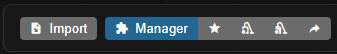
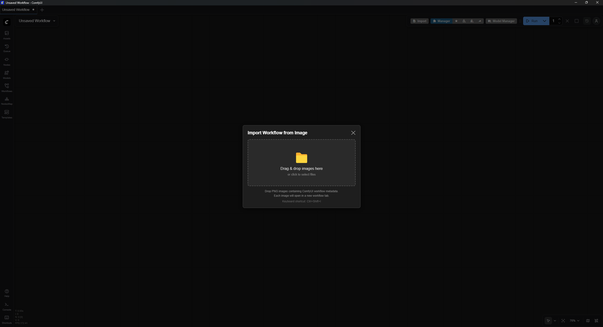

# ComfyUI Workflow Importer

Repository: https://github.com/Matthew-X/comfyui-workflow_importer

Import complete ComfyUI workflows directly from images that contain embedded workflow metadata.

Status: Experimental — still in testing and may have some unforeseen issues.

This extension adds:
- A **toolbar button + dialog** for drag-and-drop import of images.
- A **keyboard shortcut** (`Ctrl`+`Shift`+`I`) to open the import dialog.

## Features

- Import one or multiple images at once; each image opens in a **new workflow tab**.
- Supports common ComfyUI metadata keys for both **workflow graphs** and **API prompt** formats.
- Detects images that only contain Automatic1111 parameters and reports a clear error.
- Works with both **new-style ComfyUI UI menu** (0.2.0+) and **legacy menu**:
  - New-style: adds an **Import** button group before Settings.
  - Legacy: adds an **Import** button next to the Manager button (when present).

Example UI (may differ slightly depending on theme/ComfyUI version):




## Installation

### Using Git (manual install)

1. Navigate to your `ComfyUI/custom_nodes` directory:
   ```bash
   cd /path/to/ComfyUI/custom_nodes
   ```
2. Clone this repository:
   ```bash
   git clone https://github.com/Matthew-X/comfyui-workflow_importer.git
   ```
   (This repo: https://github.com/Matthew-X/comfyui-workflow_importer)
3. Restart ComfyUI.

On startup, ComfyUI will detect the Python package and load the web extension from this repository's `web` folder.

### Via ComfyUI-Manager (when listed)

Once this repository is added to the **ComfyUI-Manager** extension list, you will be able to:

1. Open **Manager** inside ComfyUI.
2. Go to the **Available** (or Extensions) tab.
3. Search for **"Workflow Importer"** or **"Comfy.WorkflowImporter"**.
4. Install the extension and **Restart ComfyUI**.

> Until it appears in the Manager list, use the **Git/manual install** method above.

## Usage

After installation and restart:

1. **Open the Import dialog**
   - Click the **Import** button added to the top toolbar, **or**
   - Press `Ctrl`+`Shift`+`I` (on macOS: `Cmd`+`Shift`+`I`).

2. **Import workflow(s) from images**
   - Drag & drop one or more PNG/WEBP/JPEG images into the dialog, **or** click the drop area to pick files.
   - The extension will attempt to read ComfyUI workflow metadata from each image.
   - Each successfully parsed workflow is opened as a **new workflow tab**.

3. **Status and errors**
   - A status area in the dialog shows progress and results.
   - If an image contains **no ComfyUI workflow/prompt** metadata, or only **Automatic1111 parameters**, a clear message is shown.

## Compatibility & Requirements

- Tested with recent ComfyUI builds (0.2.0+), supporting both new and legacy menu layouts.
- No additional Python dependencies beyond a **standard ComfyUI installation** (Pillow and aiohttp are already bundled with ComfyUI).
- Should work with images saved by various ComfyUI versions that embed workflow/prompt metadata.

If you encounter issues with a specific image or ComfyUI version, please open an issue and, if possible, attach a sample image (or describe how it was created).

## Contributing

Bug reports, feature requests, and pull requests are welcome.

When reporting bugs, please include:
- Your OS and ComfyUI version.
- How you installed the extension (Git / Manager).
- Example image(s) or steps to reproduce.

Note: This extension was created for use when ComfyUI's built-in workflow import is temporarily or long-term broken.
